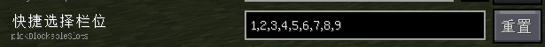

# Litematica Printer

> 本模组已在 GitHub 免费开源，若付费购买请立刻退款！作者主页 YP.MK

面向 Litematica 的 Fabric 自动化施工工具，提供批量放置、挖掘、填充、排流体、区域清除、破基岩、掉落物吸附和潜影盒收纳。

作者：**江木源（JohnMuyuan）**

## 当前发布版本

| 项目 | 要求 |
| --- | --- |
| Minecraft Java Edition | 26.1.2 |
| Fabric Loader | 0.19.1 或更高版本 |
| Java | JDK 25 |
| Fabric API | 必需 |
| MaLiLib | 客户端必需 |
| Litematica | 客户端必需 |
| QuickShulker | 潜影盒相关功能可选 |

仓库中保留了上游多版本构建结构，但当前正式发布和测试目标仅为 **Minecraft 26.1.2**。其他版本不在本版本的兼容承诺范围内。

## 功能

- 按投影批量放置方块，并处理常见方块状态和朝向。
- 在选区内批量挖掘、填充、替换和排流体。
- 清除模式按 **排流体 -> 普通挖掘 -> 破基岩** 的阶段顺序运行。
- 内置并发破基岩控制器，支持服务器确认、有限重试和吞吐量配置。
- 工作总开关启用时自动吸附附近掉落物。
- 吸附过滤可跟随挖掘黑白名单、吸附全部、仅吸附破基岩材料或使用独立名单。
- 可将掉落物自动收纳进背包中的潜影盒，潜影盒不可用或已满时回退到普通背包。
- 服务端伴生模组为多人服务器提供经过服务端验证的批处理、方块操作和物品拾取。

## 安装

### 单人游戏

将以下模组放入客户端 `mods` 文件夹：

1. Fabric API
2. MaLiLib
3. Litematica
4. `litematica-printer-0.8.0+mc26.1.2.jar`
5. QuickShulker（仅在需要潜影盒功能时安装）

单人存档不需要安装服务端伴生 JAR。

### 多人服务器

客户端按上面的单人游戏方式安装。服务器的 `mods` 文件夹另外安装：

1. Fabric API
2. `litematica-printer-server-0.8.0.jar`

服务器不需要安装客户端 `litematica-printer` JAR。客户端和服务端伴生模组的主版本必须一致。

| 环境 | 基本客户端操作 | 服务端批处理/同步 | 多人范围吸附 |
| --- | --- | --- | --- |
| 单人存档 | 支持 | 本地直接执行 | 支持 |
| 多人服务器，仅安装客户端 | 可能受延迟或反作弊限制 | 不支持 | 不支持 |
| 多人服务器，双方正确安装 | 支持 | 支持 | 支持 |

客户端未检测到服务器伴生模组时，需要服务端支持的配置项会显示黄色提示。部分普通客户端交互仍可能可用，但不能保证与单人存档相同的速度和准确性。

## 使用注意



区域清除、批量挖掘和填充等选区功能基于 Litematica 的选区。请在 Litematica 的选区模式中选择 **简单（Simple）** 模式，多角盒（Corners）与展开（Expand）模式目前仅作部分支持。

- 破基岩模式仅适用于生存或冒险模式，需要活塞、红石火把、黏液块，以及能够秒挖活塞的工具和状态。
- 每刻任务数越高，对服务器 TPS、网络延迟和背包补给速度的要求越高。出现失败或机器重叠时应先降低吞吐量。
- 服务器反作弊、交互速率限制或区域保护插件可能拒绝自动操作。
- 潜影盒自动取出和收纳依赖兼容的 QuickShulker 环境；没有可用潜影盒或空间时，物品会回退到普通背包，背包也满后停止吸附。

## 从源码构建

构建必须使用 JDK 25。Windows PowerShell 示例：

```powershell
$env:JAVA_HOME = 'C:\Users\7ipny\AppData\Roaming\.minecraft\runtime\java-runtime-epsilon'
$env:PATH = "$env:JAVA_HOME\bin;$env:PATH"
$env:TARGET_MC_VERSIONS = '26.1'
.\gradlew.bat :26.1:build :serverCompanion:build --stacktrace --console=plain
```

构建产物位于：

```text
versions/26.1/build/libs/litematica-printer-0.8.0-local+mc26.1.2.jar
serverCompanion/build/libs/litematica-printer-server-0.8.0-local.jar
```

GitHub Release 工作流会生成不带 `-local` 的正式文件，并同时提供 `SHA256SUMS.txt`。

## 问题报告

提交 Issue 时请附带：

- Minecraft、Fabric Loader、Fabric API、Litematica 和 MaLiLib 版本
- 客户端与服务端是否都安装了对应 JAR
- 可复现步骤、相关配置和完整日志
- 破基岩问题请同时说明游戏模式、工具状态、材料数量、服务器 TPS 和延迟

请勿在日志中公开账号访问令牌或包含认证信息的 `profile.json`。

## 致谢

- [aleksilassila/litematica-printer](https://github.com/aleksilassila/litematica-printer)：原始项目。
- [zhaixianyu/litematica-printer](https://github.com/zhaixianyu/litematica-printer)：早期功能扩展与修复。
- [Yur1Ca/litematica-printer](https://github.com/Yur1Ca/litematica-printer)：Hana 多版本分支。
- [MoRanpcy/quickshulker](https://github.com/MoRanpcy/quickshulker) 及其后续版本：快捷潜影盒兼容支持。
- [bunnyi116/fabric-bedrock-miner](https://github.com/bunnyi116/fabric-bedrock-miner)：破基岩实现参考。

## 许可证

本项目按照 [GNU Affero General Public License v3.0](LICENSE.md) 发布。分发修改后的模组或提供基于该程序的网络服务时，请遵守 AGPL-3.0 的源代码公开要求，并保留原项目的许可证与归属信息。
